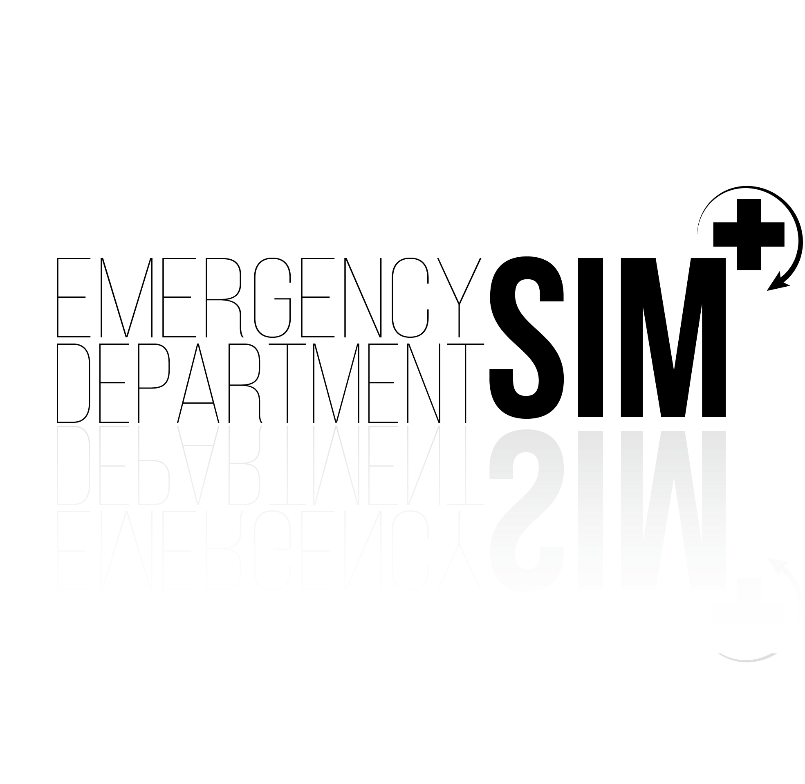
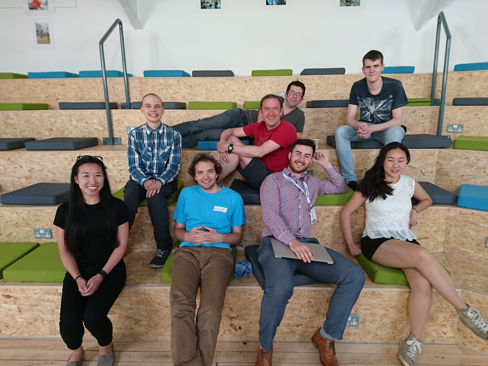

## Home page for the Emergency Department Simulation

[Summary presentation](https://docs.google.com/presentation/d/1nrt_PdvWn4YZ5diVsp4BWKBtY9UAiBZy6EfG5PFRckM/edit#slide=id.g233139c187_0_34)

## Work-in-progress

New version of simulation based upon an [open source framework](https://simjs.com) so it is easier for future teams to contribute.

[Browser based version of the simulation](https://ed-sim.github.io/ed-sim-js/index.html)

## Useful links

[Trello board](https://trello.com/b/Uusedoot/nhshdanesim)

[Shift rota for testing](https://docs.google.com/spreadsheets/d/1NDF5Ux6WLE55ewKF2hgovdZZSpZe8QoSY_QaAco5_qc/edit)

[Inputs and outouts backlog](https://docs.google.com/document/d/1TLC0QcGaRPHWLIWXR-DnyCh0tlB30kiBrsIF44X7lpE/edit)

[Spreadsheet of variables](https://docs.google.com/spreadsheets/d/1NPnO0QLv8Dw47MhOEhu89XVvzRxs0BxsUoyyFgH9y1M/edit)

[Articles](https://www.ncbi.nlm.nih.gov/pmc/articles/PMC2579496/)

[Shiny examples](https://github.com/rstudio/shiny-examples/tree/master/051-movie-explorer)

## Team photo

